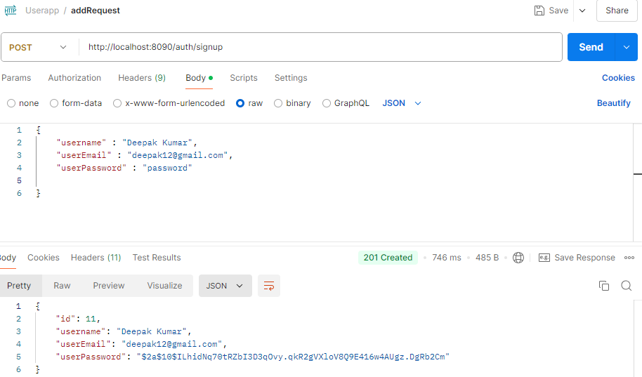

# Spring Boot CRUD Application 


## Introduction

### CRUD Application
I am using **Spring Boot** in implementing a CRUD ( **C**reate, **R**ead, **U**pdate, **D**elete) REST application where i am Adding Users & Doing operations on them *


## Project Structure
 Here is the Project Structure Explained.

The following are the base folders in which the project is organized and the purpose of each:
- [📁 application](src/main/java/com/User_app): contains the main class, annotated with `@SpringBootApplication`, which is responsible for booting up the application;
- [📁 configuration](src/main/java/com/User_app/configuration): contain the Security configuration classes annotated with `@Configuration`;
- [📁 controller](src/main/java/com/User_app/controller): contain classes annotated with `@RestController` responsible for processing incoming REST API requests;
- [📁 exception](src/main/java/com/User_app/exception): contain custom exceptions for handling specific data consistent and/or business rule violations;
- [📁 entity](src/main/java/com/User_app/entity): contain POJO classes (a.k.a. **P**lain **O**ld **J**ava **O**bject) annotated with `@Entity` representing database entities i.e., classes mapping database tables;
- [📁 repository](src/main/java/com/User_app/repository): contain classes annotated with `@Repository` responsible for providing the mechanism for storage, retrieval, search, update and delete operation on objects usually present in a database;
- [📁 service](src/main/java/com/User_app/service): contains class annotated with `@Service` in which business logic is implemented;
- [📁 security](src/main/java/com/User_app/securities): contains classes which are responsible for JWT Filters, Entry points & Authentications;

## Booting Up the Application
<ol>
<li>Clone the repository:</li>
  <code>git clone https://github.com/deepak8299/User_app.git</code>
<li>Navigate to the folder:</li>
  <code>src/main/java/com/User_app</code>
<li>Run the application:</li>
  <code>mvn spring-boot:run</code>
</ol>


## Testing the Application
1. `Create New User as a SignUp`
- URL: (http://localhost:8090/auth/signup)
- HTTP Method: POST
- Body:
  ````json
  {
   "username" : "Deepak Kumar",
    "userEmail" : "deepak12@gmail.com",
    "userPassword" : "password"
  }
  ````
  
 
We have Sucessfully registered a New User.

2. `Login the User for Authentication``
- URL: (http://localhost:8090/auth/login))
- HTTP Method: POST
- Body:
  ````json
  {
   "userName": "Deepak Kumar",
    "password" : "password"
  }
  ````
  
 
We have Sucessfully authenticated User & generated the JWT token.

If we try to Access any other API without Valid Token It will throw an 401 Not Authorized Exception
 ![NotAuth]Assets/getAllWrongToken.PNG)

3. `Get All Users `
- URL: http://localhost:8090/api/users/getAllUsers
- HTTP Method: GET
  
 

3. `Updating User`
- HTTP Method: PUT
- URL:(http://localhost:8090/api/users/{userId})
- Body:
  ````json
  {
  "username": "Deepak Gupta",
    "userEmail": "deepak123@gmail.com",
    "userPassword": "passwords"
  }
  ````
  

We have Updated the Name Email & Password for the User.

4. `Deleting the User`
- HTTP Method: DELETE
- URL: (http://localhost:8090/api/users/{userID})
  
  
  If we try to look up the deleted User by its id we will get an HTTP 404 status code response:
  


## Unit Test
To Unit Test my Application i have Used combination of **JUnit 5** & **Mockito** + some [controller](./src/main/java/com/User_app/controller) and [Service](./src/main/java/com/User_app/service) tests were implemented.

